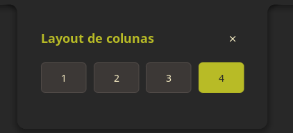

# Niri Auto Tile

> Automatic, balanced column layouts for **niri**, integrated directly into **Noctalia Shell 5**.

[](CHANGELOG.md)
[](https://noctalia.dev/)
[](LICENSE)

Niri Auto Tile keeps tiled columns evenly sized as windows open and close. Pick
how many columns should be visible, then let the plugin continuously maintain a
clean layout—without a separate daemon, manual resizing, or changes to your
niri configuration.

<p align="center">
  
</p>

> [!IMPORTANT]
> Version 2 is a Noctalia 5-only rewrite currently under testing. The previous
> Python/QML line for Noctalia 4 is discontinued. Its settings are not compatible
> with version 2 and are not migrated.

## Why Niri Auto Tile?

Niri's scrolling layout is flexible, but keeping a predictable number of
columns visible can require frequent manual resizing. Niri Auto Tile handles
that small, repetitive job automatically while respecting the way niri works.

- **Automatic redistribution** — reacts to real window open and close events.
- **Balanced widths** — visible columns share the output width evenly.
- **One-click control** — choose a 1, 2, 3, or 4-column layout from the bar.
- **Stack-aware** — multiple windows stacked in one column count as one column.
- **Floating-friendly** — floating windows are left untouched.
- **Focus-safe** — restores the previously focused window after resizing.
- **Workspace-aware** — redistributes only the affected active workspace on its output.
- **Persistent** — remembers the selected layout across Noctalia restarts.
- **Lightweight** — runs entirely in Noctalia's Luau plugin runtime.
- **Localized** — includes English, Portuguese (Brazil), German, Spanish, French,
  Italian, Japanese, Korean, Russian, and Chinese translations.

## How the layout works

The selected number is the target number of columns visible at once:

| Selection | Width with enough columns | Typical use |
|---:|---:|---|
| 1 | 100% | Focused, single-column work |
| 2 | 50% | Editor plus terminal or browser |
| 3 | ~33% | Multi-app workflows |
| 4 | 25% | Dense, wide-screen layouts |

When the selected value is equal to or greater than the current column count,
the plugin keeps the existing widths and only recenters the columns. When more
columns exist, each keeps the selected fraction of the output width, preserving
niri's horizontal scrolling model.

For example, selecting **4** leaves up to four columns at their current widths.
With five or more columns, each is set to 25%.

## Requirements

- [Noctalia Shell](https://noctalia.dev/) 5.0 or newer
- [niri](https://github.com/YaLTeR/niri)

`niri` is declared as an external plugin dependency. Noctalia may display
`Requires: niri`; this is informational and does not mean installation failed.

## Installation

### 1. Add and enable the plugin

Install directly from this GitHub repository:

```bash
noctalia msg plugins source add niri-auto-tile git https://github.com/pir0c0pter0/niri-auto-tile
noctalia msg plugins enable pir0c0pter0/niri-auto-tile
```

### 2. Add the widget to your bar

Add the widget definition and its ID to a bar in Noctalia's `settings.toml`:

```toml
[widget.niri-auto-tile]
type = "pir0c0pter0/niri-auto-tile:widget"

[bar.default]
center = ["date", "clock", "niri-auto-tile"]
```

Keep any widgets already present in your bar list; the example only shows where
`niri-auto-tile` fits.

### 3. Validate and reload Noctalia

```bash
noctalia config validate
noctalia msg config-reload
```

The bar now shows the column icon and the active division. Click it to open the
selector.

## Usage

1. Click the Niri Auto Tile widget in the Noctalia bar.
2. Select a layout from **1** to **4** columns.
3. Open or close tiled windows normally.

The new selection is applied immediately, saved to the plugin data directory,
and reused after Noctalia restarts. Title changes and other updates to an
existing window do not trigger unnecessary redistribution.

You can also open or close the panel externally:

```bash
noctalia msg panel-toggle pir0c0pter0/niri-auto-tile:panel
```

## What happens behind the scenes

The plugin starts with Noctalia, reads niri's current window list, and listens
to `niri msg -j event-stream`. After an open or close event, it:

1. selects the affected workspace when it is active on its output;
2. groups its tiled windows by column;
3. calculates the width for the selected visible-column limit;
4. resizes one representative window per column;
5. anchors and centers the visible columns; and
6. restores the window that was focused before redistribution.

Events are briefly coalesced to avoid repeated work during bursts, and another
pass is queued if the layout changes while redistribution is already running.

## Plugin entries

| Entry | ID | Purpose |
|---|---|---|
| Widget | `pir0c0pter0/niri-auto-tile:widget` | Shows the active division and opens the panel |
| Panel | `pir0c0pter0/niri-auto-tile:panel` | Provides the 1–4 column selector |
| Service | `pir0c0pter0/niri-auto-tile:service` | Watches niri and maintains column widths |

## Scope and limitations

Version 2 deliberately keeps one global 1–4 column preference. It does not
provide per-workspace rules, edit `niri` configuration, expose runtime tuning,
or run as a standalone daemon. These were legacy version 1 capabilities and
are not part of the Noctalia 5 rewrite.

The current 2.0.4 release is distributed from this Git repository while live
testing is completed; it has not yet been submitted to Noctalia's official
plugin registry.

## Development

The plugin is implemented in Luau and has no separate runtime process. Run the
logic checks and Noctalia lint before submitting changes:

```bash
lua test_service.lua
noctalia plugins lint niri-auto-tile
```

Project structure:

```text
niri-auto-tile/
├── plugin.toml       # Plugin manifest and entry declarations
├── service.luau      # Event handling and redistribution logic
├── widget.luau       # Noctalia bar widget
├── panel.luau        # Column selector panel
└── translations/     # Localized UI strings
```

See the [changelog](CHANGELOG.md) for release history and
[publishing notes](PUBLISHING.md) for the current distribution status.

## License

Released under the [MIT License](LICENSE).
